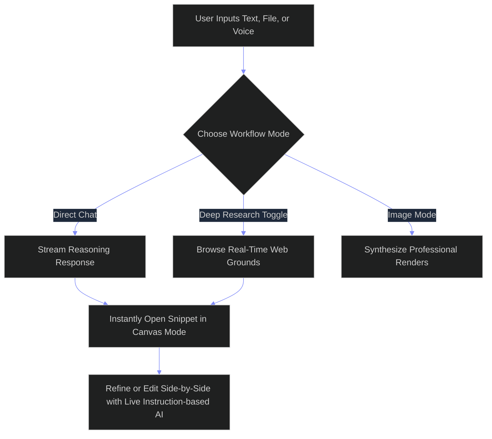
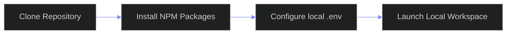
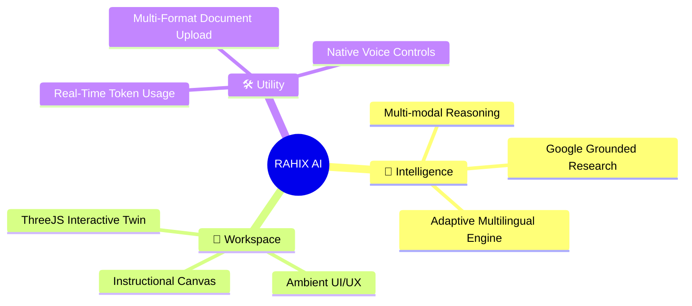
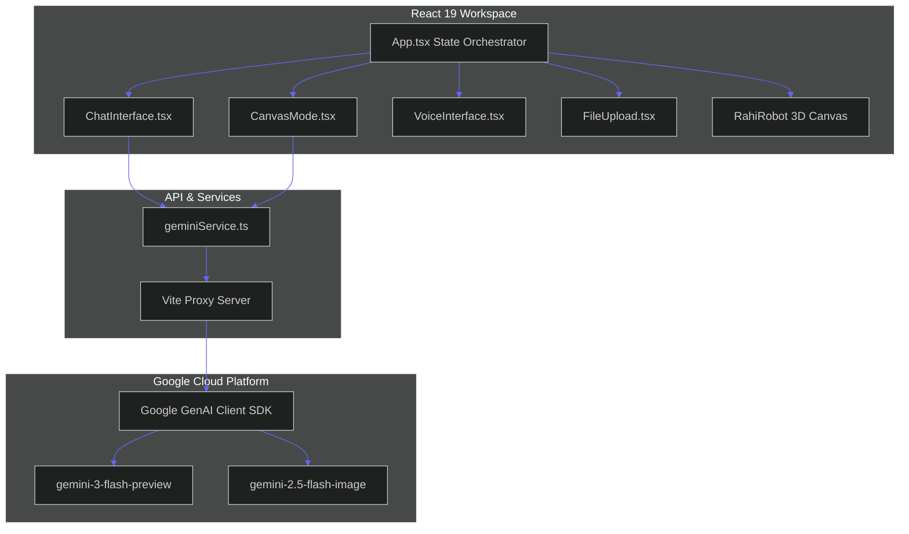

<div align="center">

# 🤖 RAHIX AI
### Your Intelligent Multi-Modal Workspace with Real-Time Grounding and Collaborative Canvas

[](LICENSE)
[](https://react.dev)
[](https://typescriptlang.org)
[](https://deepmind.google/technologies/gemini/)

Get a lightning-fast, production-ready environment that blends multi-modal AI reasoning, live web grounding, and side-by-side canvas editing to speed up your technical workflows by 10x.

</div>

---

## 🖼️ How It Works



RAHIX orchestrates multi-turn sessions by streaming tokenized requests to Google's fastest multi-modal models.

You can dynamically toggle between visual generation, deep web index analysis, and document parsing.

The system automatically updates the persistent workspace view based on the output category of your prompts.

---

## ⚖️ Why RAHIX AI?

| Feature / Core Capability | RAHIX AI | Traditional Chat Clients | Standalone Code Editors |
| :--- | :---: | :---: | :---: |
| **Inline Canvas Co-editing** | ✅ **Native** | ❌ None | ❌ Plugin-Required |
| **Real-Time Web Grounding** | ✅ **Built-in** | ❌ Optional/Slow | ❌ None |
| **Multi-modal File Analysis**| ✅ **Instant** | ❌ Subscription | ❌ Complex setup |
| **Zero-Configuration Setup** | ✅ **1 Step** | ❌ Complex Portal | ❌ Dynamic Configs |

Choose RAHIX if you want to bypass the friction of copying and pasting code between isolated browser tabs.

---

## ⚡ Quick Start



### Required Prerequisites

| Tool Name | Required Version | Functional Purpose |
| :--- | :--- | :--- |
| **Node.js** | `v18.0.0` or higher | JavaScript runtime execution |
| **NPM** | `v9.0.0` or higher | Package dependency manager |
| **Gemini API Key**| Latest production | Neural model requests authentication |

### Running the Project

1. **Clone the repository** to your local environment.
```bash
git clone https://github.com/rahulcvwebsitehosting/rahixai.git
cd rahixai
```

2. **Install all required dependencies** in one step.
```bash
npm install
```

3. **Configure your API keys** inside the local environment.
```bash
echo "GEMINI_API_KEY=your_production_key_here" > .env.local
```

4. **Launch the developer local server** on port 3000.
```bash
npm run dev
```

---

## 🌟 Core Features



### 🧠 Intelligence
The platform provides instant multilingual understanding across three production languages with full context awareness.

You can execute raw query grounding directly through deep Google Search scraping to retrieve real-time citations.

```bash
# Force the system to use Hindi protocols internally
language: hi
```

### 🎨 Workspace
The dual-panel setup houses a reactive textual co-editor with instruction-based refinement.

An interactive Three.js component generates dynamic engineering models right inside your view.

```typescript
// Refine code in canvas on demand
const refined = await geminiService.refineCanvasContent(content, instruction, 'code');
```

### 🛠 Utility
The app measures API usage automatically against free-tier thresholds to prevent connection drops.

You can upload massive document matrices and images to process multi-turn structural queries.

```typescript
// Support multiple file inputs instantly
const supportedTypes = ['application/pdf', 'image/png', 'image/jpeg'];
```

---

## 🏗️ System Architecture



### Directory Structure

```
.
├── .env.local
├── .gitignore
├── App.tsx
├── index.html
├── index.tsx
├── metadata.json
├── package.json
├── tsconfig.json
├── types.ts
├── vite.config.ts
├── components/
│   ├── AILoader.tsx
│   ├── AboutPage.tsx
│   ├── CanvasMode.tsx
│   ├── ChatInterface.tsx
│   ├── ExpertisePage.tsx
│   ├── FileUpload.tsx
│   ├── LandingPage.tsx
│   ├── ProfileView.tsx
│   ├── ProjectsPage.tsx
│   ├── RahiRobot.tsx
│   ├── SettingsPage.tsx
│   ├── Sidebar.tsx
│   ├── UsageMonitor.tsx
│   └── VoiceInterface.tsx
└── services/
    └── geminiService.ts
```

### Core Components

| Component Name | Language | Functional Purpose |
| :--- | :--- | :--- |
| **App.tsx** | TypeScript | Handles global state orchestration and routing |
| **CanvasMode.tsx** | TypeScript | Manages interactive document and code modification side-by-side |
| **geminiService.ts** | TypeScript | Connects directly to Google's generative models API |
| **RahiRobot.tsx** | TypeScript | Houses the interactive Three.js 3D viewport |
| **VoiceInterface.tsx**| TypeScript | Integrates native browser microphone input |
| **FileUpload.tsx** | TypeScript | Controls multi-format file attachment operations |
| **UsageMonitor.tsx** | TypeScript | Measures real-time rate limit thresholds |

---

## 💻 Development Guide

### Workspace Configuration

| Configuration Target | File Location | Purpose |
| :--- | :--- | :--- |
| **Bundler Config** | `/vite.config.ts` | Builds server and processes env injects |
| **System Typing** | `/types.ts` | Stores immutable global interface contracts |
| **Static Assets** | `/index.html` | Houses default Tailwind config and static viewport styles |

### Running the Test Build

Compile the application payload locally to verify bundle integrity.

```bash
npm run build
```

Run the local server in developer preview mode to simulate the production build.

```bash
npm run start
```

---

## ⚠️ Honest Maintenance & Risk Disclosures

### Free Tier API Limitations
You must recognize that Google's free-tier key uses strict rate limits (currently capping requests at 30 RPM).

Rapid-fire prompt execution may lead to temporary API throttling and return model system warnings.

### Client-Side Security Realities
The environment uses a server proxy setup to keep API keys hidden during runtime.

You should rotate your API credentials immediately if you suspect any external exposure.

### Offline Resilience
This workspace depends entirely on live Google GenAI cloud endpoints for its reasoning.

You cannot execute multi-modal inference or search queries while completely offline.

---

## 💬 Frequently Asked Questions

### Can I run this system completely offline?
No, the multi-modal reasoning and search grounding features require active connections to the Google Cloud APIs.

### Is my private data used to train the models?
No, your session details stay fully local unless you explicitly authorize cloud transmission.

### How do I modify the default rate limits?
You can update the threshold variable directly in the `App.tsx` source code.

### Does this application support headless integrations?
No, the architecture is tailored specifically as a responsive graphical client workspace.

### What files can I safely upload?
You can upload image formats like PNG and JPEG alongside rich text and PDF files.

### Do I need to pay for a subscription to use this?
No, you only need to supply your own developer-tier API key from Google.

---

## 🤝 Contributing

You are welcome to submit bug reports or propose new features through our main issue tracker.

### Quick Start for Contributors

1. Fork the workspace repository to your personal account.
2. Create a new branch with a descriptive name.
3. Commit your precise typescript modifications.
4. Open a clean pull request against our main development branch.

```bash
# Create your feature branch instantly
git checkout -b feature/amazing-feature
```

You can track active tasks and scheduled releases directly inside the project dashboard.

---

## 📄 License & Attribution

Distributed under the terms of the MIT License.

This system utilizes upstream engineering frameworks including Vite, Three.js, and Tailwind CSS.

---

<div align="center">

**[Get Started](https://ais-dev-qmfhridukdj2ml3sbutyvc-116124795411.asia-southeast1.run.app) • [Download](https://github.com/rahulcvwebsitehosting/rahixai/archive/refs/heads/main.zip) • [Contribute](https://github.com/rahulcvwebsitehosting/rahixai/blob/main/CONTRIBUTING.md) • [Report Issue](https://github.com/rahulcvwebsitehosting/rahixai/issues)**

Designed by **Rahul Shyam**  
*CTO & Senior Architect*

</div>
